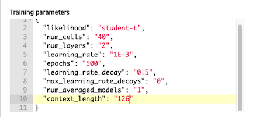

# Amazon Forecast Workshop for Logistics, Transportation, and Supply Chain

Introduction: Amazon Forecast is a machine learning service that provides prediction based on time series data.

### A.1. Open SageMaker console

We will leverage on SageMaker Studio for data preparation and visualization.

1. Click this link, https://ap-southeast-1.console.aws.amazon.com/sagemaker/home?region=ap-southeast-1
2. On the upper right of the console, ensure the region selected is `Singapore` 


### A.2. Open SageMaker studio

1. On the left menu, click `Amazon SageMaker Studio`
2. On the right pane, a user have been automatically created for you. 
3. Click `Open Studio`. It may take approximately 2-5 minutes for the studio to launch.


### A.3. Clone the repository

1. Once launched, locate git icon on the left menu (it will be the  second icon from top). 
2. Click `Clone a Repository`
3. You will be prompted for a git URL, paste `https://github.com/yudho/logistics-transport-sc-forecast-workshop.git`
4. Click `Clone`
5. Click on the folder `logistics-transport-sc-forecast-workshop` to view all the notebooks


### A.4. Opening notebook

In the notebook, we will be downloading a public dataset on NYC taxi pickups, transform it into a target time series CSV file, and upload it to S3 to be used with Amazon Forecast. 

1. Double-click on the notebook `01_prepare-target-time-series.ipynb` to open it.
2. Select `Python 3 (Data Science)` as the kernel when prompted. 

**Important**
```
Launching a kernel can take up to 10 minutes. 
While launching, the kernel status (shown on the top right) will be "unknown  Python 3 (Data Science)" 
Once it is ready, the status will become "2 vCPU + 4 GiB Python 3 (Data Science)"
``` 


### A.5. Running cells

1. When kernel is ready, click `Run > Run All Cells` menu on the top bar


Cells are successfully ran when they display number on the left. When they show `[*]`, it means that the cell is still running.
Throughout the session, we will be diving deeper on the dataset used, the transformation done, and the resulted CSV file structure in the notebook.

**Important**:
```
The second last cell will output the IAM Role Amazon Resource Name (ARN) to be used later by Forecast. 
Please take note of this string. It looks like arn\:aws\:iam\:\:xxxxxxxxxxxx:role/ForecastToS3
```

### A.6. Generate Related Time Series as Input Data

This notebook will generate a related time series data to support the target time series.

1. open "02_prepare-related-time-series.ipynb" notebook
2. Run all cells using the similar steps above, `Run > Run All Cells`. 
3. Ensure all cells are executed

### A.7. Generate Item Metadata as Input Data

This notebook will generate metadata for the items (pickup locations) to support the target time series

1. open "03_prepare-item-metadata.ipynb" notebook
2. Run all cells using the similar steps above, `Run > Run All Cells`.
3. Ensure all cells are executed

## Section B: Import Data to Forecast
### B.1 Go to Forecast Console

Now we have done with the data preparation. All the CSV files will be uploaded in S3 bucket, to be used as input data by Amazon Forecast. Let's go to Amazon Forecast.

1. Click this link to go to forecast, https://ap-southeast-1.console.aws.amazon.com/forecast/home?region=ap-southeast-1#landing


### B.2 Create Dataset Group and Create TTS Dataset

Dataset group is a construct which group the target time series, related time series, and item metadata you have for a particular project. We need to create one. 

1. In the Forecast UI console, Click `Create dataset group` 
2. Fill up the form
```
Dataset group name: nyc_taxi
Forecasting domain: Custom
```

3. Click `Next`
4. Fill up the form
```
Dataset name: target_time_series
Frequency of your data: **1 hour**
```

5. Ensure the order of the attributes (by dragging) to be:
```
1) timestamp
2) item_id
3) target_value
```

6. Under "Dataset import details":
```
Dataset import name: tts_v1
Select time zone: America/New_York
```

7. On `Data location`, click `Browse S3`.
   1. On the search bar type `sagemaker-`
   2. Click the bucket name, `sagemaker-(region-name)-(your-account-id)`.
   3. Click the folder `nyc-taxi-trips`
   4. Select the file "tts.csv"
   5. Click "Choose".

8. On IAM Role, select "Enter a custom IAM role ARN" and paste the Forecast IAM Role ARN you copied from step A.5. 
    1. You can open SageMaker Studio and find the ARN displayed on the second last cell of the first notebook ("01_prepare-target-time-series.ipynb")
9. Click "Start" to import the data to Forecast.

### B.3 Create RTS Dataset

After importing the TTS (Target Time Series), let's also import RTS (Related Time Series) that we have. 

1. Click this link to go to forecast, https://ap-southeast-1.console.aws.amazon.com/forecast/home?region=ap-southeast-1#landing
2. Click `View dataset groups`
3. Under Dataset groups, Click `nyc_taxi`  
4. On the left pane, click `Datasets`
5. Select "RELATED_TIME_SERIES"
6. Click "Upload dataset" 
7. Fill up the form
```
Dataset name: related_time_series
Frequency of your data: 1 hour
```
8. Click `Add attribute` 
```
Attribute Name: day_hour_of_the_week
Attribute Type: string
```
9. Ensure the order of the attributes (by dragging) to be:
```
1) timestamp
2) item_id
3) day_hour_of_the_week
```
10. Under "Dataset import details"
```
Dataset import name: rts_v1
```
11. On "Data location" click "Browse S3". 
   1. On the search bar, type `sagemaker-` and click the bucket name, "sagemaker-(region-name)-(your-account-id)".
   2. Click the folder "nyc-taxi-trips"
   3. Select the file "rts.csv"
   4. Click "Choose".

For the IAM Role, please select "Enter a custom IAM role ARN" and paste the ARN we had from step A.5

Click "Start" orange button to start importing the data to Forecast.

### B.4 Create Item Metadata Dataset
After importing the RTS, let's also import item metadata that we have. Click the "Upload dataset" orange button. Select "ITEM_METADATA" and click "Start import"

Details:
- Dataset name: item_metadata

Add attribute by clicking on "Add attribute button" with name "area". Add another attribute with name "category". Make sure the attribute order follows this:
1) item_id
2) area
3) category

Under "Dataset import details":
- Dataset import name: im_v1

On "Data location" click "Browse S3". On the search bar type "sagemaker-" and find the correct bucket name. The correct one should be "sagemaker-(region-name)-(your-account-id)". Click the bucket name.

Now find this folder "nyc-taxi-trips" inside the bucket, and you should find "im.csv" inside. Select that file and click "Choose".

For the IAM Role, please select "Enter a custom IAM role ARN" and paste the ARN we had from step A.5

Click "Start" orange button to start importing the data to Forecast.

Please monitor the Datasets page and only proceed with the next step when all datasets are imported and active.

## Section C: Train The Forecasting Model
### C.1 Create Predictor
From the Forecast datasets UI, click "Dashboard" on the left menu. Click the "Start" orange button next to "Predictor training". Please fill-up this detail:

- Predictor name: prophet_algo
- Forecast horizon: 168
- Forecast frequency: 1 hour
- Algorithm selection: Manual
- Algorithm: Prophet
- Holidays: Enable holidays
- Select a country: United States

Please click "Start" orange button

Once redirected to the Forecast dashboard page, you can check periodically whether the training is finished by clicking "View predictors". The process took around 17 minutes for me.

### C.2 Create Another Predictor
We will generate another predictor using DeepAR+ algorithm as comparison. 

Please follow the steps in C.1 but using "DeepAR+" algorithm and name: "deepar_algo". Also under "Advanced configurations", look at "Training parameters" section and change the context_length to 126. This is how many data points Amazon Forecast will use to generate the forecasting. From my previous run, I found this number to yield good result.



DeepAR+ training can be longer, from 29 minutes to 1 hour few minutes. We can proceed with section D without waiting for the DeepAR+ predictor since we will use the Prophet predictor for creating the forecast. Later once the DeepAR+ model training is finished, you can compare the quality metrics.

## Section D: Create Forecast
Once your predictor is created, that means that the model training has been done. The model can then be used to generate forecast based on input data (inference time). So, you can append more data in the dataset, and create forecast accordingly. This can be itertive. For now, let's just create a forecast based on the data we already have in our dataset.
### D.1 Create Forecast
From the Forecast dashboard, click "Start" orange button next to "Forecast generation". Please fill-up these details:
- Forecast name: after_feb_2020
- Predictor: prophet_algo

Click "Start" orange button and please wait until the forecast is done. The process is estimated to take 11-14 minutes.

## Section E: Visualize Forecast
### E.1 Lookup
From the Forecast dashboard, click "Forecast lookup" and then fill-up these details:
- Forecast: after_feb_2020
- Start date: 2020/02/23 00:00:00
- End date: 2020/03/06 23:00:00
- Forecast key - Value: 230

Click "Get Forecast" orange button


### E.2 Another Lookup
Still on the Forecast lookup page, try out different value, like "231". This represents forecasting for different the pickup locations