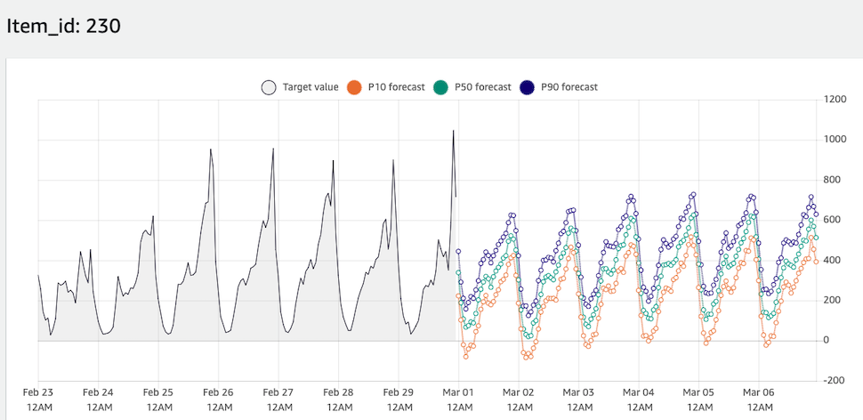

# Amazon Forecast Workshop for Logistics, Transportation, and Supply Chain
*No code workshop to experiment on Amazon Forecast*

Introduction: Amazon Forecast is a machine learning service that provides prediction based on time series data provided by AWS.

## Section A: Data Preparation
### A.1 Region selection
Please check with your instructor about the regions where you will be working for this hands-on. You can change it by selecting the region name in the upper right of the screen:

### A.2 Go to SageMaker
We will use SageMaker Studio for data preparation. Type "sagemaker" on the search bar on top and click "Amazon SageMaker"

### A.3 Enter studio
On SageMaker console, locate and click "Amazon SageMaker Studio" on the left menu. There should be a user already created on the right pane. Click "Open studio". It may take a while for the studio to open, probably around 2-5 minutes.

### A.4 Download the Notebooks
Once the studio is open, locate the left menu and click the second icon from top for Git. 

Then click "Clone a Repository". When asked for the git URL, paste https://github.com/yudho/logistics-transport-sc-forecast-workshop.git and click "CLONE"

It should clone the notebooks and open up the folder structure. Please click the folder "logistics-transport-sc-forecast-workshop".

### A.5 Open First Notebook
Amazon Forecast requires 1 main dataset, which is the target time series. In this case, we will use the Jupyter Notebook to download a public dataset on NYC taxi pickups, transform as necessary to form the target time series CSV file, and upload it to S3 to be used with Forecast.

Please double click file "01_prepare-target-time-series.ipynb". 

Once opened, please select "Python 3 (Data Science)"" as the kernel when asked. **Important**: Kernel can take minutes to be ready, especially if this is the first time you open the studio. On the top right, if you see the instance type is "Unknown", you can just wait first until the kernel is ready 

On the top right, ensure that the Kernel active is Python 3 (Data Science) with EC2 size of 2 vCPU + 4 GiB RAM. 

### A.6 Generate Target Time Series as Input Data
After the kernel is ready, click "Run" menu on the top bar and click "Run All Cells". 

Along with instructor, you can dive deeper on the dataset used, the transformation done, and the resulted CSV file structure in the notebook. Please wait until all cells are run before moving to the next step. Cells are successfully run when they display number on the left. When they show " \* ", it means that the cell is still running.

### A.7 Generate Related Time Series as Input Data
Please open "02_prepare-related-time-series.ipynb" notebook and run all cells using the similar steps above. Here we are generating a related time series to support the target time series. Please make sure all cells are run.

### A.8 Generate Item Metadata as Input Data
Please open "03_prepare-item-metadata.ipynb" notebook and run all cells using the similar steps above. Here we are generating metadata for the items (pickup locations) to support the target time series forecasting. Please make sure all cells are run. 

## Section B: Import Data to Forecast
### B.1 Go to Forecast Console
Now we have done with the data preparation. All the CSV files are uploaded in S3 bucket, to be used as input data by Amazon Forecast. Let's go to Amazon Forecast.

Select your web browser tab which displays the main AWS UI console, not the SageMaker Studio Jupyter Lab UI. On the search bar on top, type "forecast". Click "Amazon Forecast".

### B.2 Create Dataset Group and Create TTS Dataset
Dataset group is a construct which group the target time series, related time series, and item metadata you have for a particular project. We need to create one. 

In the Forecast UI console, locate the "Create dataset group" orange button. Then please fill-up the form:

- Dataset group name: nyc_taxi
- Forecasting domain: Custom

Then click the "Next" orange button

On the next page, we will create the target time series dataset within the dataset group we just defined:
- Dataset name: target_time_series
- Frequency of your data: **1 hour**

Switch the order of the attributes (by dragging) so that the order will be:
1) timestamp
2) item_id
3) target_value

Under "Dataset import details":
- Dataset import name: tts_v1
- Select time zone: America/New_York

On "Data location" click "Browse S3". On the search bar type "sagemaker-" and find the correct bucket name. The correct one should be "sagemaker-(region-name)-(your-account-id)". Click the bucket name.

Now find this folder "nyc-taxi-trips" inside the bucket, and you should find "tts.csv" inside. Select that file and click "Choose".

For the IAM Role, select "Enter a custom IAM role ARN" and paste "arn\:aws\:iam\:\:\<AWS account ID\>\:role/ForecastToS3". Replace \<AWS account ID\> with the 12 digits account ID located on the top right corner as shown in the picture below

Click "Start" orange button to start importing the data to Forecast.

### B.3 Create RTS Dataset
After importing the TTS (Target Time Series), let's also import RTS (Related Time Series) that we have. From the Forecast Dataset group UI console, click the dataset group name we have just created. Click "Datasets" on the left menu. Then click "Upload dataset" orange button. Select "RELATED_TIME_SERIES" and click "Start import"

Details:
- Dataset name: related_time_series
- Frequency of your data: 1 hour

Add attribute by clicking on "Add attribute button" with name "day_hour_of_the_week" and type is "string". Rearrange the attribute by dragging so that the order will be:
1) timestamp
2) item_id
3) day_hour_of_the_week

Under "Dataset import details":
- Dataset import name: rts_v1

On "Data location" click "Browse S3". On the search bar type "sagemaker-" and find the correct bucket name. The correct one should be "sagemaker-(region-name)-(your-account-id)". Click the bucket name.

Now find this folder "nyc-taxi-trips" inside the bucket, and you should find "rts.csv" inside. Select that file and click "Choose".

Click "Start" orange button to start importing the data to Forecast.

### B.4 Create Item Metadata Dataset
After importing the RTS, let's also import item metadata that we have. Click the "Upload dataset" orange button. Select "ITEM_METADATA" and click "Start import"

Details:
- Dataset name: item_metadata

Add attribute by clicking on "Add attribute button" with name "area". Add another attribute with name "category". Make sure the attribute order follows this:
1) item_id
2) area
3) category

Under "Dataset import details":
- Dataset import name: im_v1

On "Data location" click "Browse S3". On the search bar type "sagemaker-" and find the correct bucket name. The correct one should be "sagemaker-(region-name)-(your-account-id)". Click the bucket name.

Now find this folder "nyc-taxi-trips" inside the bucket, and you should find "im.csv" inside. Select that file and click "Choose".

Click "Start" orange button to start importing the data to Forecast.

Please monitor the Datasets page and only proceed with the next step when all datasets are imported and active.

## Section C: Train The Forecasting Model
### C.1 Create Predictor
From the Forecast datasets UI, click "Dashboard" on the left menu. Click the "Start" orange button next to "Predictor training". Please fill-up this detail:

- Predictor name: deepar
- Forecast horizon: 168
- Forecast frequency: 1 hour
- Algorithm selection: Manual
- Algorithm: DeepAR+
- Holidays: Enable holidays
- Select a country: United States

Please click "Start" orange button

Once redirected to the Forecast dashboard page, you can check periodically whether the training is finished by clicking "View predictors".

## Section D: Create Forecast
Once your predictor is created, that means that the model training has been done. The model can then be used to generate forecast based on input data (inference time). So, you can append more data in the dataset, and create forecast accordingly. This can be itertive. For now, let's just create a forecast based on the data we already have in our dataset.
### D.1 Create Forecast
From the Forecast dashboard, click "Start" orange button next to "Forecast generation". Please fill-up these details:
- Forecast name: after_feb_2020
- Predictor: deepar

Click "Start" orange button and please wait until the forecast is done.

## Section E: Visualize Forecast
### E.1 Lookup
From the Forecast dashboard, click "Forecast lookup" and then fill-up these details:
- Forecast: after_feb_2020
- Start date: 2020/02/23 00:00:00
- End date: 2020/03/06 23:00:00
- Forecast key - Value: 231

Click "Get Forecast" orange button

